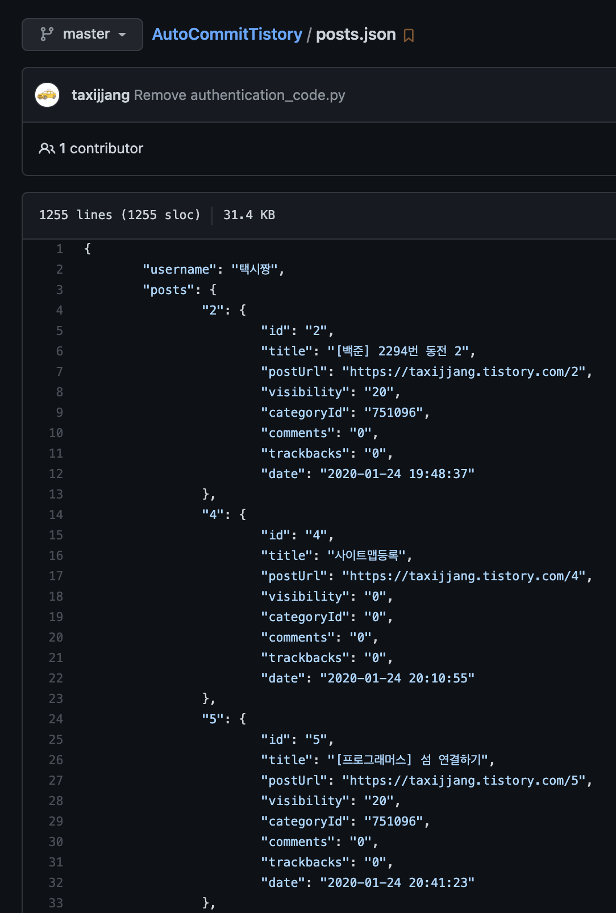
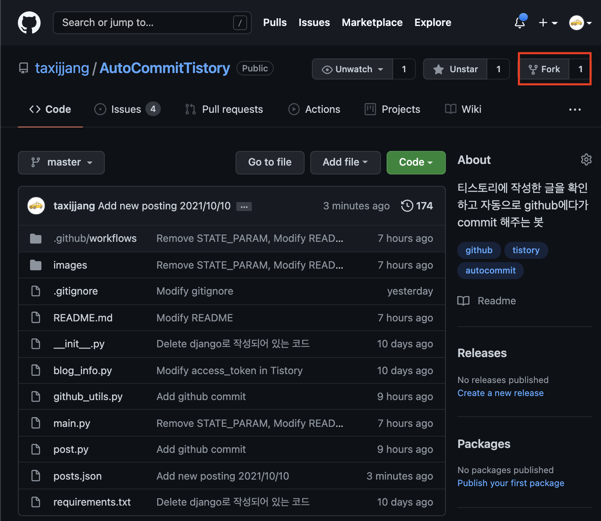
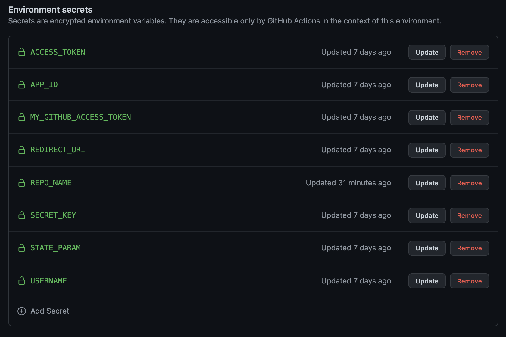

# AutoCommitTistory
[](https://github.com/taxijjang/AutoCommitTistory/actions/workflows/tistory_auto_commit.yml)

### [내용 정리 블로그](https://taxijjang.tistory.com/171)

### 개요
- 블로그 포스팅을 tistory에서 현재 진행을 하고 있는데, github에도 나의 블로그 포스팅의 기록을 남기고 싶어서 진행한 프로젝트
- 티스토리에 작성한 글을 확인하고 자동으로 commit, issue 등록


---
### 결과
- git action을 이용하여 UTC 기준 14시 45분 (KST 기준 23시 34분)에 현재 새롭게 작성된 블로그 글이 있는지 확인 하여 새로운 이슈 생성과 json파일에 post정보 저장
[포스팅 알림 이슈 링크](https://github.com/taxijjang/AutoCommitTistory/labels/new_posting)
- 새로운 이슈 등록


  
- json파일에 포스팅 정보 저장
[추가된 json파일](https://github.com/taxijjang/AutoCommitTistory/blob/master/posts.json)


---
### 사용방법
1. AutoCommitTistory repository를 fork 한다.

   

2. 아래에서 티스토리 access token과 github access token을 발급 한다.
   

3. fork를 한 위치의 repository에 발급한 token과 여러 환경 변수들을 github repository secret에 추가한다.

---
### 티스토리 access token 발급
- [티스토리 access token 발급 방법](https://taxijjang.tistory.com/144)


---
### github access token 발급
- [github access token 발급 방법](https://docs.github.com/en/authentication/keeping-your-account-and-data-secure/creating-a-personal-access-token)


---
### 환경 변수 설정
1. repo의 `settings`로 이동
2. `settings`의 `Secret`에서 `Actions secrets`를 이용하여 `New repository secret`를 생성

   
- 환경 변수 정의
```
- github
MY_GITHUB_ACCESS_TOKEN: github에서 발급한 access token

- tistory
APP_ID: 발급된 app_id
SECRET_KEY: secret_key
REDIRECT_URI: 본인 티스토리 주소를 입력합니다 ex) https://taxijjang.tistory.com
ACCESS_TOKEN: tistory에서 발급 받은 access_token
USERNAME: 이슈에 남길 이름 ex)USERNAME의 블로그
REPO_NAME: 해당 프로젝트가 포함되어 있는 github repository의 이름
```
